# Black Box Bayesian Optimization  – Weekly Progress Report

## Overview

This project uses Bayesian optimization to maximize outputs of **eight blackbox functions** over 13 weeks, using only **one function evaluation per week**.  
A Gaussian Process surrogate model was used to predict outputs and guide input selection.  

**Goal:** Maximize outputs efficiently while learning about function landscapes.

**Initial Data:**  
[Download the initial data ZIP](../../data/original/Initial_data_points_starter.zip)

**Weekly Results Notebook:**  
[WeeklyResults.ipynb](https://github.com/AnnemarieKeller/MLProject_CapstoneBlackBoxOptimisation/blob/main/analysis/WeeklyResults.ipynb)

---

## Week 1 – Initial Notebook Prototype

**Activities:**  
- Explored the provided notebook for Bayesian Optimization.  
- Experimented with UCB acquisition functions.  

**Observations:**  
- Notebook statefulness caused previously found best values to persist unintentionally.  
- Acquisition function comparisons were unreliable.  

**Conclusion & Reasoning:**  
- Early notebook-based prototyping is useful but **script-based implementations are required** for reproducibility.

**Notebook Reference:** [General BO notebook](https://github.com/AnnemarieKeller/MLProject_CapstoneBlackBoxOptimisation/blob/main/notebooks/firstcodeexample.ipynb)  
> *Note: This notebook is provided as a sample for transparency; it does not include exact submissions.*

---

## Week 2 – Structural Reflection

**Activities:**  
- Continued experimentation within the notebook.  
- Evaluated pros/cons of modular vs. notebook implementations.  

**Observations:**  
- Hidden state in notebooks made results non-reproducible.  
- Difficult to fairly compare surrogate models and acquisition strategies.  

**Conclusion & Reasoning:**  
- Moving to **script-based modular framework** improves reproducibility and makes experiments comparable.

---

## Week 3 – SVR Surrogates & Dimensional Adaptation

**Activities:**  
- Tested SVR surrogates ([SVR notebook](https://github.com/AnnemarieKeller/MLProject_CapstoneBlackBoxOptimisation/blob/main/notebooks/svr.ipynb)) on **Functions 4–8**.  
- Implemented dimension-aware candidate generation:
    - ≤3D: dense random grid or LHS  
    - 4–5D: LHS or Sobol sequences  
    - ≥6D: trust-region local sampling  
- Introduced dynamic exploration schedule:

    ```python
    beta = max(0.5, 2.0 / np.sqrt(iteration + 1))
    ```

**Observations:**  
- SVR identified promising regions but underestimated predictive uncertainty.  
- Dimensionality-aware candidate generation improved coverage in ≥4D functions.

**Conclusion & Reasoning:**  
- SVR ensembles are useful for initial exploration but **Gaussian Processes are preferred** due to reliable uncertainty estimation.  

---

## Week 4 – Neural Networks & Kernel Engineering

**Activities:**  
- Tested neural network surrogates ([NN notebook](https://github.com/AnnemarieKeller/MLProject_CapstoneBlackBoxOptimisation/blob/main/notebooks/neuralnetworks.ipynb)) on Functions 3, 6, 7.  
- Applied polynomial feature expansion to capture low-order interactions.  
- Experimented with GP kernels: RBF, Matern, WhiteKernel.

**Observations:**  
- NN surrogates were able to fit complex patterns but were unstable for acquisition-based optimization.  
- GP kernels with function-specific tuning provided more reliable predictions.

**Conclusion & Reasoning:**  
- For Bayesian Optimization, **interpretable GP surrogates outperform black-box NN models** in low-evaluation settings.

---

## Week 5 – Ensemble Methods & Acquisition Refinement

**Activities:**  
- Implemented SVR ensemble to approximate uncertainty for Function 8.  
- Tested Random Forest surrogate for Function 6.  
- Refined acquisition functions (EI, UCB) per function.

**Observations:**  
- EI was more robust than UCB for high-dimensional functions.  
- Ensemble pseudo-uncertainty helped exploration but lacked calibration.

**Conclusion & Reasoning:**  
- Surrogate choice must balance **predictive accuracy** and **uncertainty calibration**.

---

## Week 6 – Migration to Python Scripts & Adaptive Kernel Lengths

**Activities:**  
- Migrated all experiments to standalone Python scripts ([Optimization Pipeline](https://github.com/AnnemarieKeller/MLProject_CapstoneBlackBoxOptimisation/blob/main/notebooks/runfunctions.ipynb)).  
- Introduced **adaptive GP kernel length scales**.

**Observations:**  
- Clean resets improved reproducibility.  
- SVR misaligned predictions highlighted the need for uncertainty-aware surrogates.  
- Adaptive kernel lengths allowed GP to handle diverse function landscapes.

**Conclusion & Reasoning:**  
- **Script-based GP framework with adaptive kernels** is now reliable for weekly BO submissions.

---

## Week 7 – Full Gaussian Process Strategy

**Activities:**  
- Transitioned to GP-only surrogates.  
- Systematic kernel experimentation and hyperparameter tuning.  
- Introduced GP health diagnostics (noise level, length-scale sanity, marginal likelihood).  

**Observations:**  
- Functions 1–3: Matern kernel performed well.  
- Functions 4–8: RBF kernel provided smoother predictions.  
- GP health metrics helped detect convergence issues.

**Conclusion & Reasoning:**  
- Health metrics are critical to diagnose **noisy or plateaued functions** before submitting new points.

---

## Week 8 – Stability and Monitoring

**Activities:**  
- Refined logging, acquisition tracking, noise diagnostics.  
- Implemented **dynamic candidate generation strategies** per function (dense exploit, global explore, etc.).  

**Observations:**  
- Stability improved across high-dimensional and noisy functions.  
- Candidate generation matched function type and dimensionality.

**Conclusion & Reasoning:**  
- Structured candidate strategies **reduce risk of missing promising regions**.

---

## Week 9 – Interpretability Integration & Strategy Map

**Activities:**  
- Integrated SHAP and LIME to explain GP predictions and acquisition decisions.  
- Updated **function-specific strategies** based on early feedback. 
- **Introduced  PDF execution reports** for each run:
  - Surrogate predictions 
  - gp health score  
  - Observed outputs and diagnostics  


**Observations:**  
- Functions 1, 4, 6: Exploit dense or locally refine known peaks.  
- Functions 2, 5, 7: Emphasized global exploration to detect scattered or rare peaks.  
- Function 3, 8: Used refinement and portfolio strategies for multimodal or high-dimensional landscapes.  

**Conclusion & Reasoning:**  
- Interpretability **informed adjustments to candidate generation** and acquisition combinations.  

---

## Weeks 10–13 – Evolving Strategies & Dynamic Acquisition

**Strategy Evolution:**

- **Exploration vs Exploitation:**  
  - Functions with **rare high peaks** (2, 5, 7) emphasized exploration using high beta or Portfolio acquisitions.  
  - Functions with **well-characterized regions** (1, 6) focused on exploitation with UCB, PI, or EI.  
  - High-dimensional or multimodal functions (4, 8) combined refinement and mixed acquisitions.

- **Dynamic Acquisition Parameters:**  
  - Beta/kappa values adjusted per week to modulate exploration intensity.  
  - Early weeks used higher exploration (higher beta) for uncertain functions; later weeks reduced beta to exploit known peaks.

- **Strategy Types:**  
  - Dense Exploit: Concentrate on known high-value regions (Functions 1, 4).  
  - Global/Noisy Explore: Sample widely to find scattered peaks (Functions 2, 5, 7).  
  - Local Exploit: Refine small, known maxima (Functions 6).  
  - Explore-then-Exploit: Begin with exploration, then focus on promising regions (Functions 5, 7).  
  - Refinement: Fine-tune acquisition around previously sampled high-value points (Functions 3, 8).  

- **Manual Validation:**  
  - Week 12: Manual submissions for Function 5 confirmed previously unexplored high-value regions.  
  - Strategy adaptation ensured GP did not overcommit to early peaks.

**Key Takeaways:**  
- Candidate generation and acquisition strategies must **adapt weekly** based on surrogate confidence, observed noise, and dimensionality.  
- Dynamic tuning of acquisition parameters allows a controlled balance of exploration and exploitation.  
- Strategy evolution is **essential in low-evaluation, high-uncertainty optimization**.

---

## Week 11 – Kernel & Stability Adjustments

**Activities:**  
- Further kernel adjustments for Function 6.  
- Stability improvements across all functions.  

**Observations:**  
- Diagnostics aligned GP hyperparameters with actual function behavior.  

**Conclusion & Reasoning:**  
- Continuous monitoring ensures BO remains reliable week-to-week.

---

## Week 12 – Transformations & Manual Interventions

**Activities:**  
- Applied **Yeo–Johnson transformation** for skewed targets.  
- Manual submissions for Function 5 (points 2–2–2–2 and 2.5–2.5–2.5–2.5) to check for higher-value regions.

**Observations:**  
- GP focused on known regions and underestimated unknown peaks.  
- Manual points confirmed structure of Function 5.

**Conclusion & Reasoning:**  
- Manual intervention can **validate GP assumptions** and prevent missing global optima.

---

## Week 13 – Final Consolidation

**Activities:**  
- Final acquisition scheduling and kernel stabilization.  
- All experiments run through script-based GP-only framework.  
- Reviewed weekly results and confirmed reproducibility.

**Observations:**  
- Framework now **diagnostics-driven, interpretable, and modular**.  
- Candidate generation, acquisition, and kernel strategies finalized.

**Conclusion & Reasoning:**  
- few more weeks time would have been beneficial to learn more about the functions and mature the framework
- adding a LLM to interpret the results would add value

---

## Function-Specific Observations

| Function | Observed Behaviour |
|----------|------------------|
| **Function 1** | Smooth plateau, high peak difficult to locate. |
| **Function 2** | Noisy, repeated inputs gave different outputs. |
| **Function 3** | Complex local optima; maximization via minimization transformation. |
| **Function 4** | Difficult to optimize consistently. |
| **Function 5** | High-value region found late; manual interventions validated global peak. |
| **Function 6** | Similar to Function 3, noisy outputs. |
| **Function 7** | High-dimensional; slow improvement; risk of local optima. |
| **Function 8** | High-dimensional, complex but not noisy; repeated inputs confirmed consistency. |

**Function Landscapes:**  
Individual 13-week function landscape representations are available in the repo (`analysis/landscape.ipynb`) for reference.
here examples for function 5 through week 1 - 13 of the experiment: 

**Week 1**

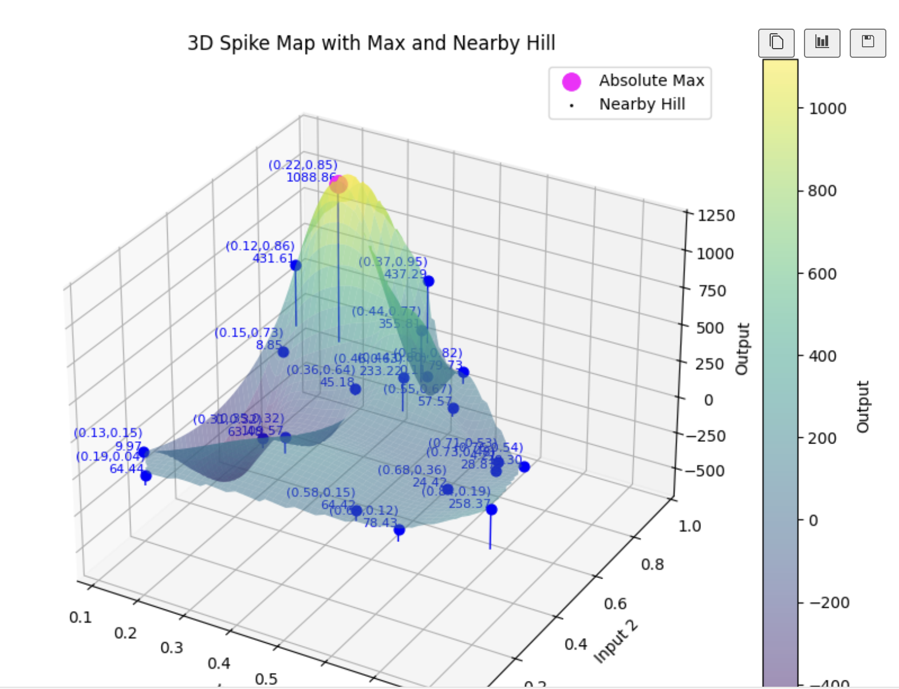

**Week 2**

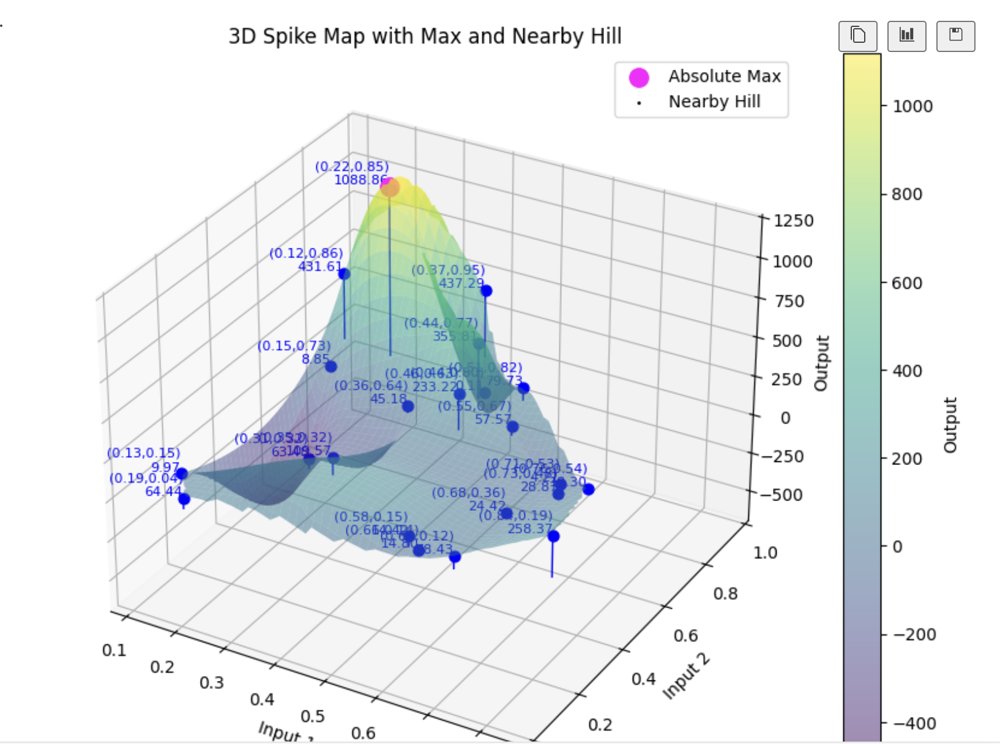

**Week 3**

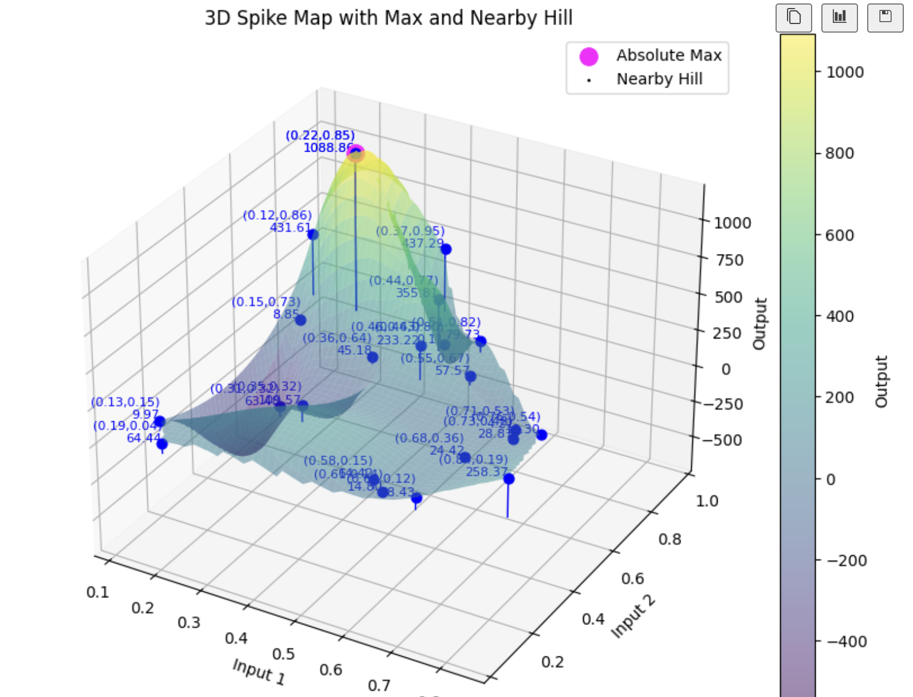

**Week 4**

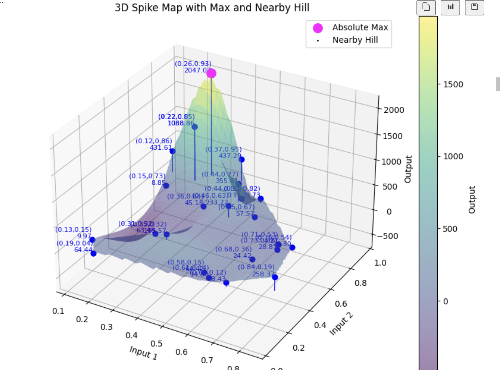

**Week 5**

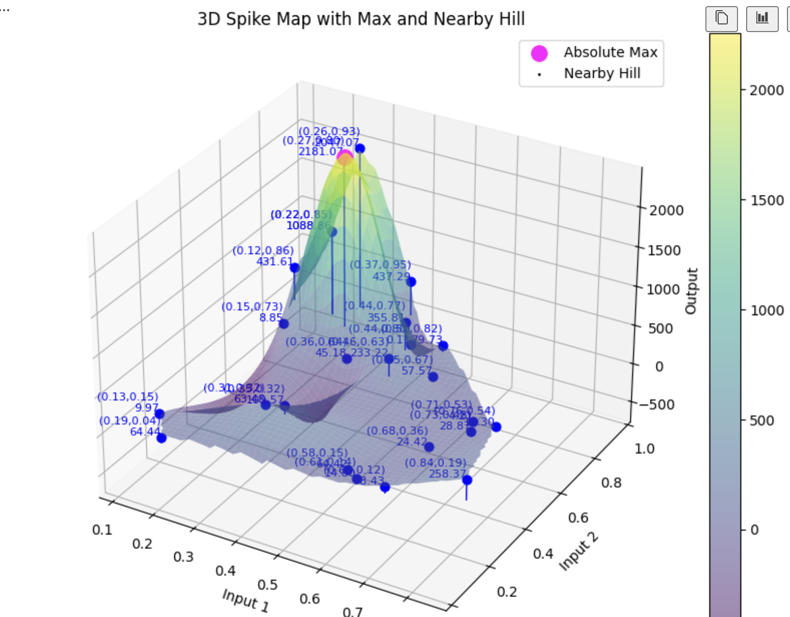

**Week 6**

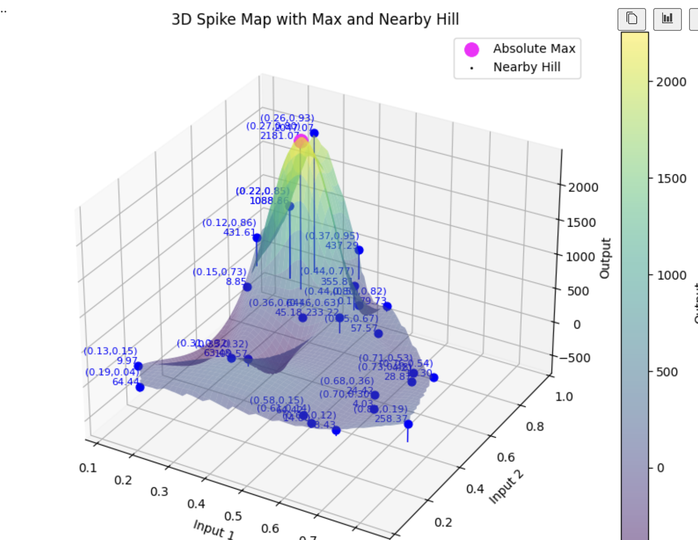

**Week 7**

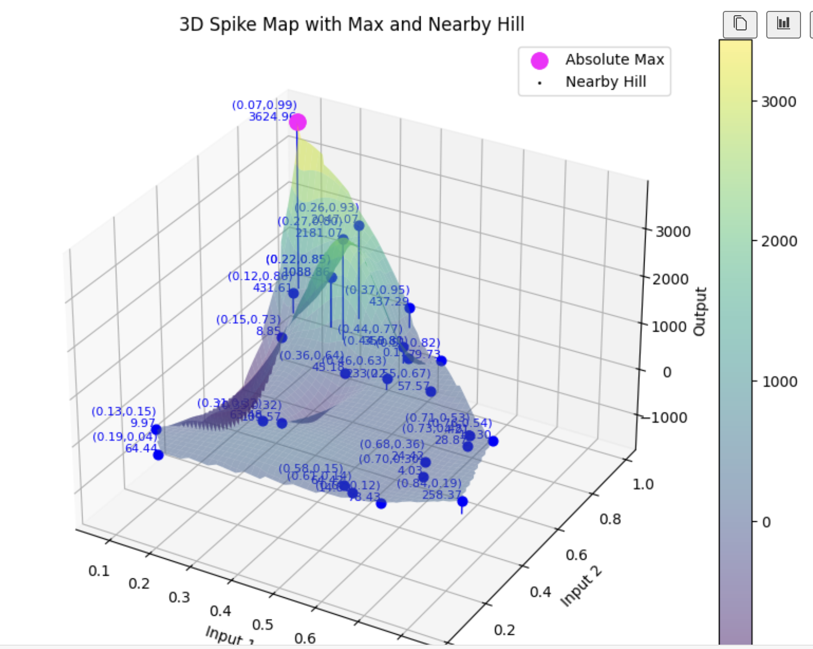

**Week 8**

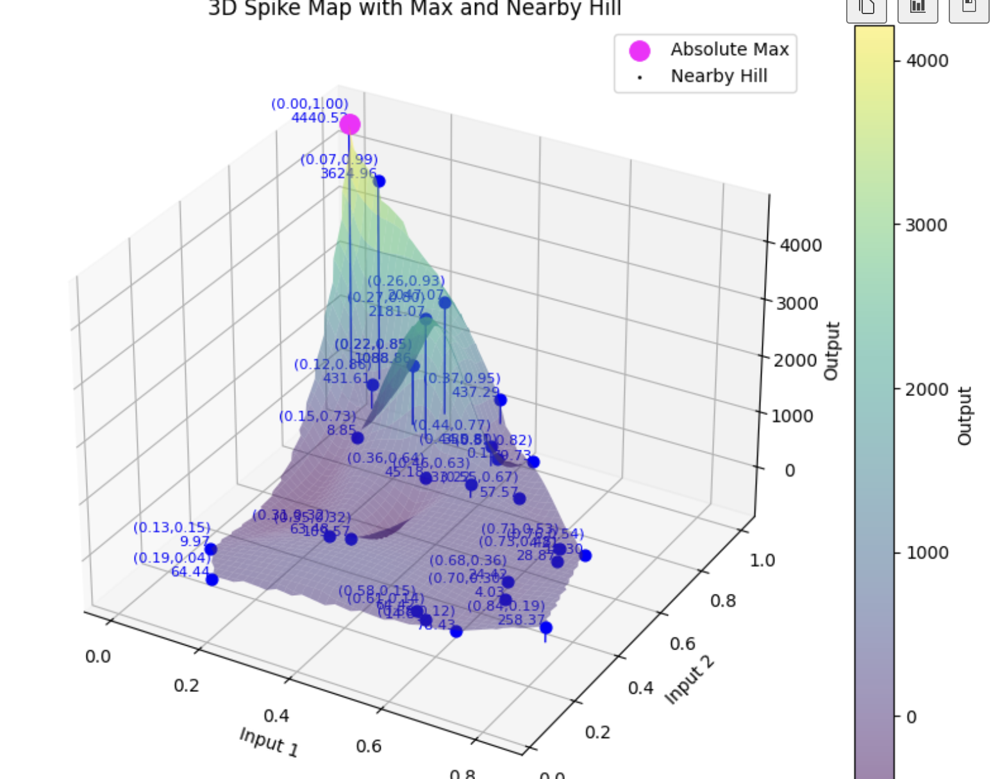

**Week 9**

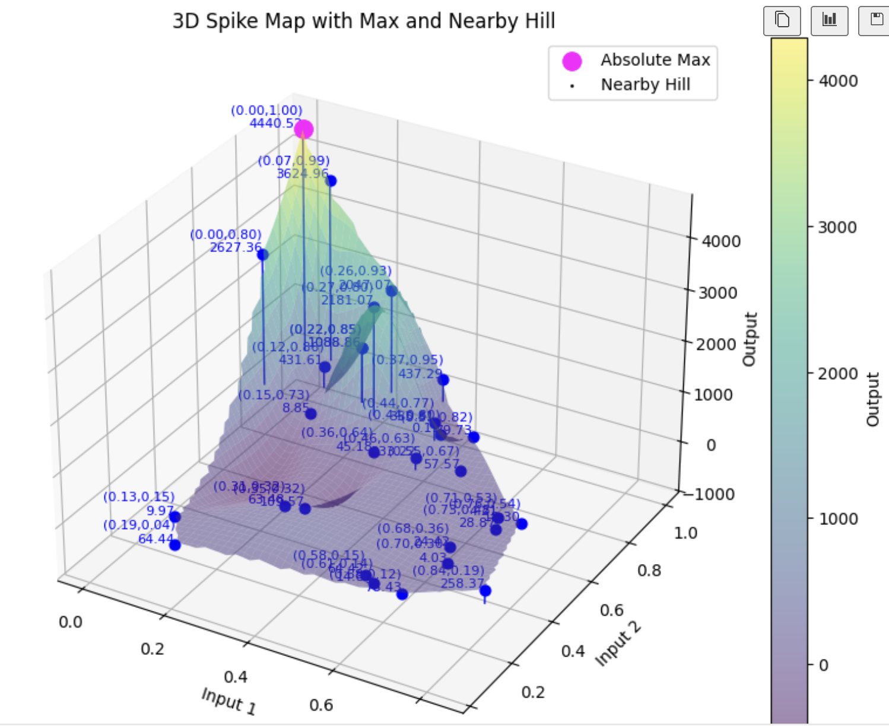

**Week 10**

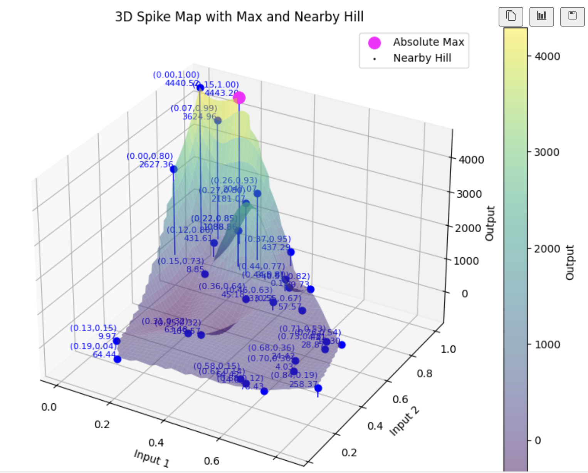

**Week 11**

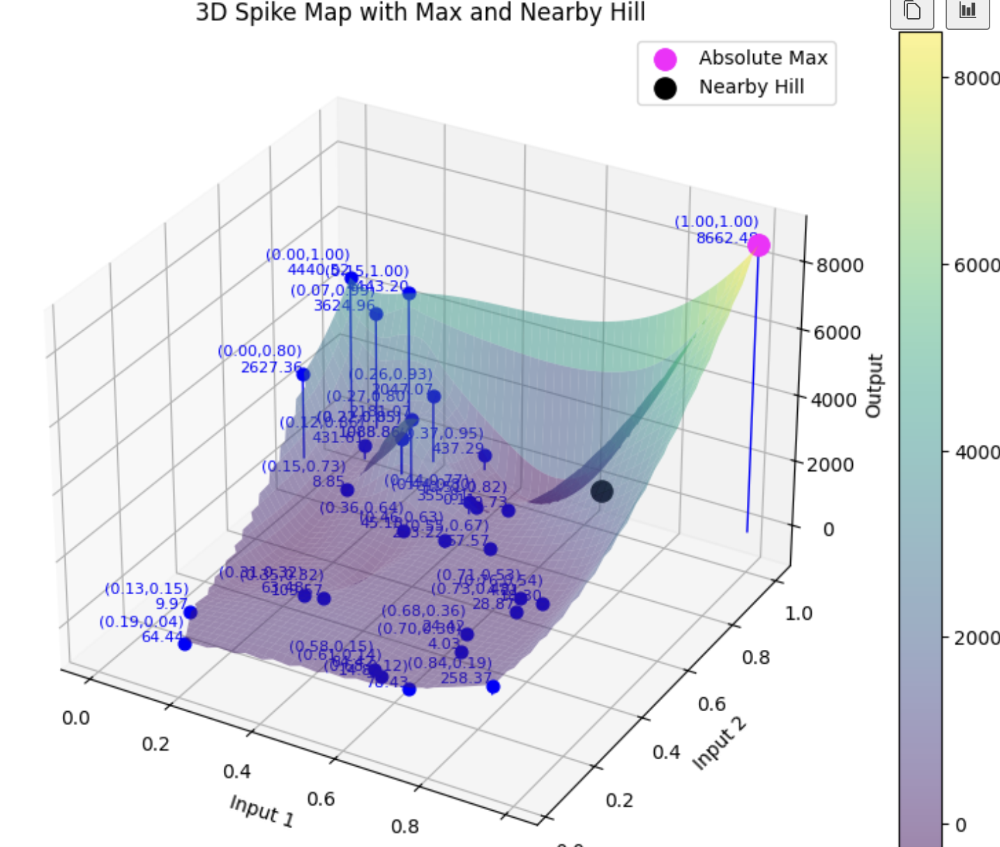

**Week 12**

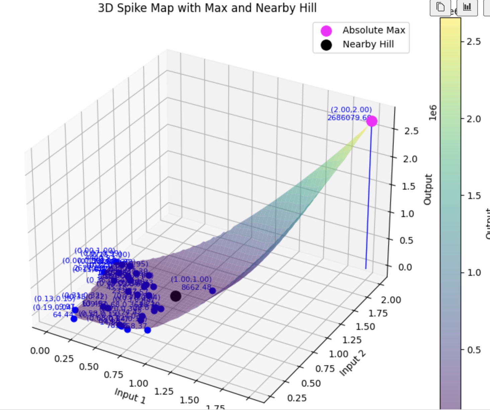

**Week 13**

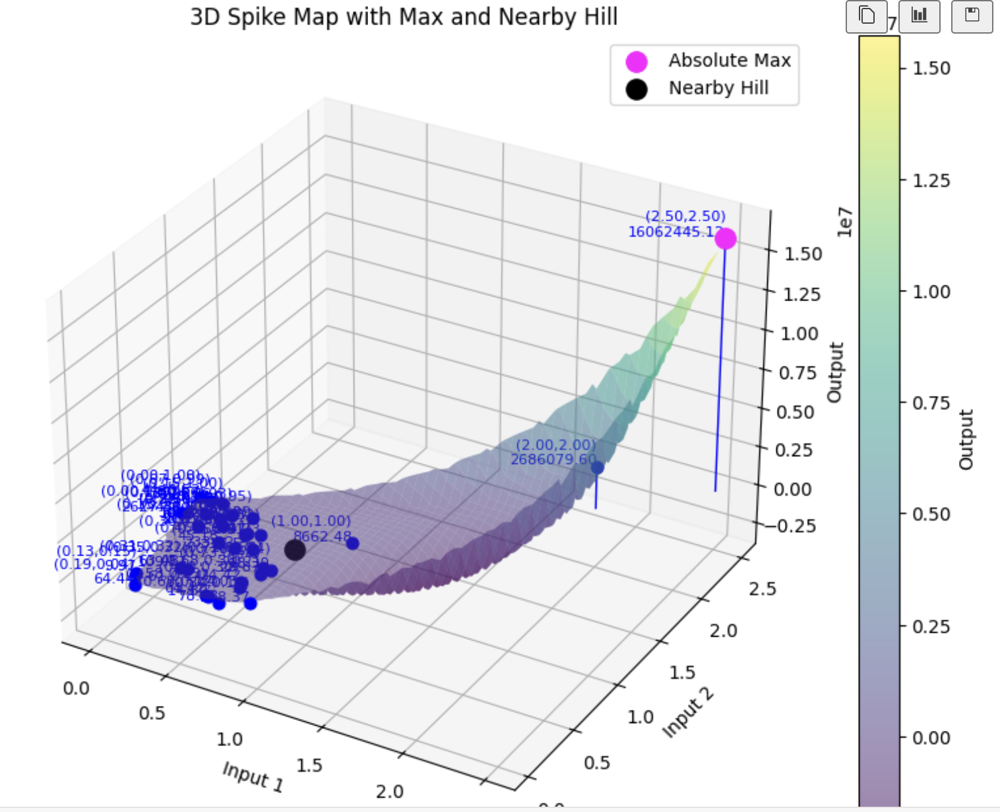
---

## Key Takeaways

- Early high outputs can bias GP toward local regions.  
- Limited weekly evaluations require careful exploration strategies.  
- Gaussian Process surrogates with calibrated uncertainty perform best.  
- Adaptive kernel lengths improve handling of diverse landscapes.  
- Manual interventions validate assumptions and prevent missing peaks.  
- Interpretability (SHAP, LIME) enhances trust and debugging.  


---

## Links

- **General BO notebook (Weeks 1–2):** [General BO](https://github.com/AnnemarieKeller/MLProject_CapstoneBlackBoxOptimisation/blob/main/notebooks/firstcodeexample.ipynb)  
- **SVR notebook:** [SVR](https://github.com/AnnemarieKeller/MLProject_CapstoneBlackBoxOptimisation/blob/main/notebooks/svr.ipynb)  
- **Random Forest notebook:** [RF](https://github.com/AnnemarieKeller/MLProject_CapstoneBlackBoxOptimisation/blob/architecture/main/rainforestsurrogate.ipynb)  
- **Neural Network notebook:** [NN](https://github.com/AnnemarieKeller/MLProject_CapstoneBlackBoxOptimisation/blob/architecture/main/neuralnetworks.ipynb)  
- **Optimization pipeline / final GP scripts:** [notebook](https://github.com/AnnemarieKeller/MLProject_CapstoneBlackBoxOptimisation/blob/main/analysis/functions/dynamicloop.ipynb)  
- **Weekly results:** [WeeklyResults.ipynb](https://github.com/AnnemarieKeller/MLProject_CapstoneBlackBoxOptimisation/blob/main/analysis/WeeklyResults.ipynb)  

